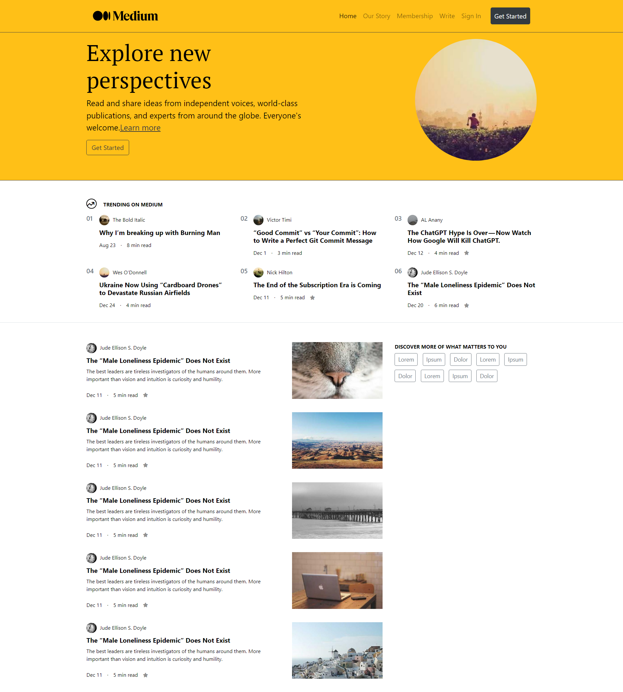

# Bootstrap Medium Klonu
Bootstrap Medium Klonu, Medium'un modern ve şık kullanıcı arayüzünü Bootstrap kullanarak yeniden oluşturmayı amaçlayan bir projedir. Bu proje, kullanıcıların Medium'un kullanıcı dostu arayüzünü analiz etmelerine ve aynısını oluşturarak kullanıcı deneyimini geliştirmelerine olanak tanır.

## Genel Bakış

Medium, makaleleri okumak ve yayınlamak için popüler bir platformdur. Kullanıcılarına yüksek kaliteli içerik sunmayı hedefleyen temiz ve sezgisel bir arayüz sunar. Medium kullanıcı arayüzünü Bootstrap, HTML ve CSS kullanarak yeniden oluşturmayı amaçlamaktadır.

## Özellikler

Bu proje, aşağıdaki özelliklere sahip bir Medium arayüzü klonu oluşturmayı hedeflemektedir:

- Ana sayfadaki makale görüntülemesi
- Öne çıkan hikayeler bölümü
- Yazar profillerini gösterme
